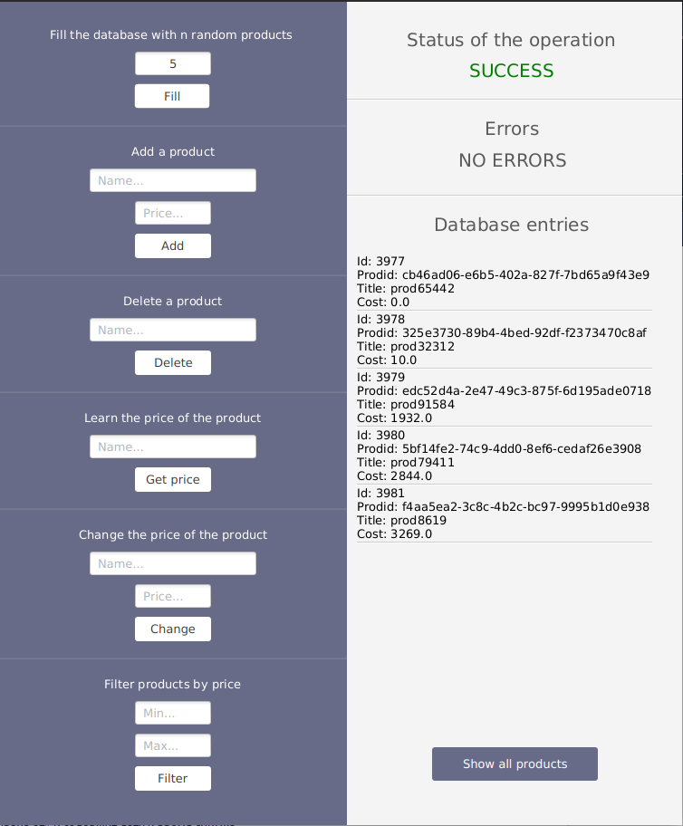
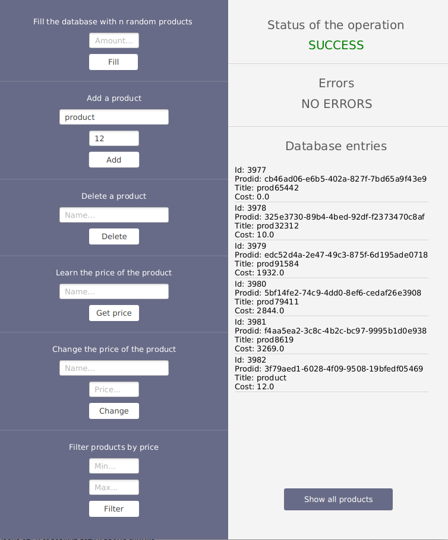
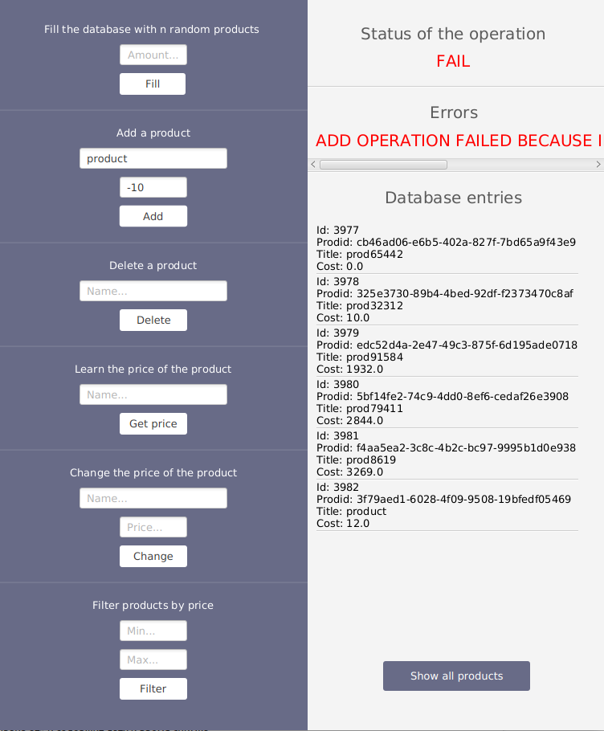

# Лабораторная_5

## [Задание](./documentation/Task.md)

## Пример работы программы





## Инструкция по сборке проекта

### Предусловия

JDK - версия 1.11.
[Инструкция по установке](https://docs.oracle.com/en/java/javase/11/install/)

Gradle - версия 6.1.1.
[Инструкция по установке](https://docs.gradle.org/current/userguide/installation.html)

Git - любая версия.
[Инструкция по установке](https://www.atlassian.com/git/tutorials/install-git)

MySql - версия 14 и выше
[Инструкция по установке](https://dev.mysql.com/doc/mysql-getting-started/en/)

Также в [конфигурационном файле](./src/main/java/app/data/local/utils/ConnectionConfig.java) необходимо установить данные своего sql сервера и его пользователя.

### Сборка

Все действия необходимо проводить в корневой папке проекта lab5.

Ввести команду:

* Unix
```
./gradlew build
```

* Windows
```
gradlew.bat build
```

### Запуск unit тестов

Ввести команду: 

* Unix
```
./gradlew test
```

* Windows
```
gradlew.bat test
```

### Запуск

* Из консоли
    * Ввести команду: ```./gradlew run``` на Unix или ```gradlew.bat run``` на Windows

* Из IntelliJIDEA
    * Ввести команду: ```./gradlew openIdea``` на Unix или ```gradlew.bat openIdea``` на Windows
    * Во вкладке gradle справа выбрать task run.

